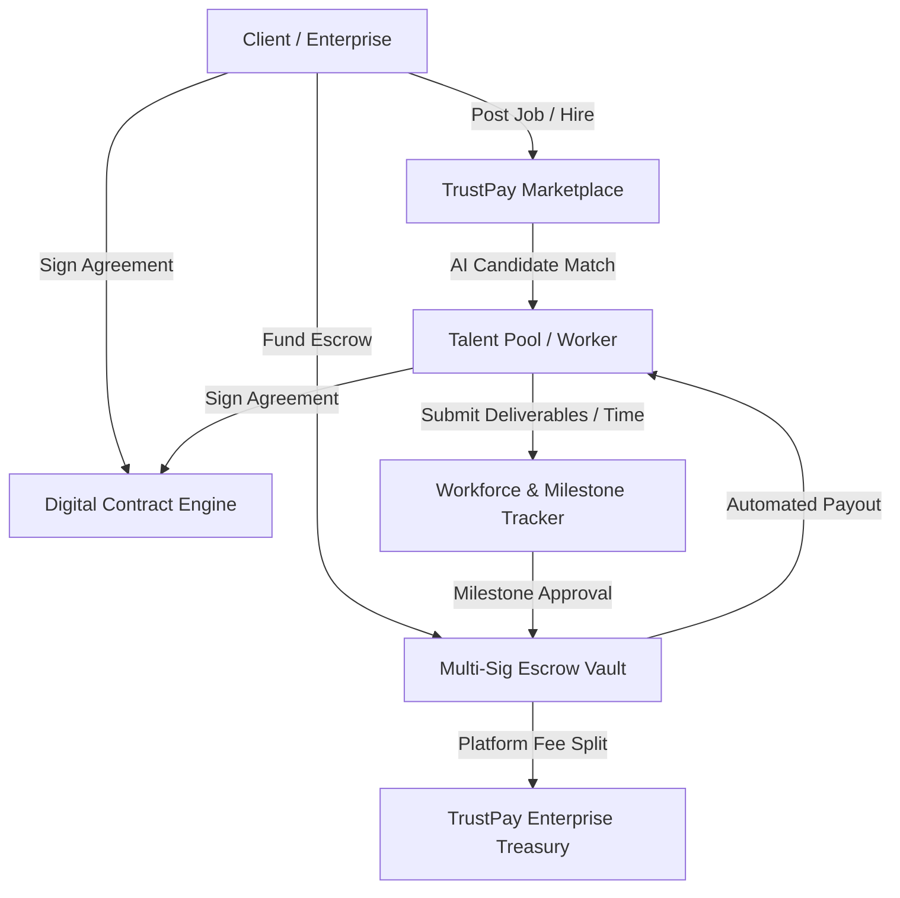

# 01. Project Overview & Problem Statement – TrustPay Enterprise v2.0

## 1. What is TrustPay?

**TrustPay** is an all-in-one **Enterprise Digital Contract, Multi-Sig Escrow Vault, Workforce Management, and Decision Intelligence Platform**. 

It serves as a unified ecosystem connecting global enterprises, organizations, clients, and remote talent through secure, AI-assisted digital contracts, automated escrow funding, transparent milestone payouts, workforce productivity tracking, and executive decision intelligence.

Unlike conventional freelancing platforms or basic payment gateways, TrustPay provides a complete end-to-end lifecycle—from initial talent discovery and AI-powered job matching to digital signature contracts, multi-sig escrow locking, dispute arbitration, workforce time-tracking, and executive financial reporting.

---

## 2. Why Was TrustPay Built?

The modern global economy is shifting rapidly towards remote, distributed workforces and contract-based talent. However, the software infrastructure powering high-stakes digital transactions and global remote hiring remains fragmented, insecure, and prone to financial friction.

Existing freelancing platforms and payment gateways force enterprises to juggle 5 to 7 disconnected software tools:
1. **Job boards** (for posting jobs)
2. **E-signature tools** (for contract signing)
3. **Escrow/banking services** (for payment protection)
4. **Time tracking software** (for workforce management)
5. **Ticketing tools** (for dispute handling)
6. **Accounting platforms** (for invoicing and financial reporting)

TrustPay was built to **consolidate these disparate tools into a single, production-hardened enterprise system** that guarantees financial security, legally compliant contracts, transparent workforce oversight, and automated dispute resolution.

---

## 3. Real-World Problems Solved

### A. Freelancer Payment Default & Delayed Payouts
- **Problem**: Remote workers frequently face non-payment, scope creep, or delayed payments after completing hours of skilled work.
- **TrustPay Solution**: Multi-Sig Escrow Vault locks 100% of milestone funds *before* work begins. Funds cannot be withdrawn unilaterally by clients once milestones are funded.

### B. Client Risk & Deliverable Quality Ambiguity
- **Problem**: Clients risk paying upfront to unreliable contractors who fail to deliver expected software or service quality.
- **TrustPay Solution**: Funds are held securely in escrow and released incrementally only when client-defined milestone criteria and time tracking proof are approved.

### C. Informal & Unenforceable Agreements
- **Problem**: Verbal agreements and informal chats lead to ambiguous scope definitions and costly legal disputes.
- **TrustPay Solution**: Legally binding digital contracts with cryptographic signature hashes, version tracking, and automated AI contract risk analysis.

### D. Fragmented Remote Workforce Management
- **Problem**: Enterprises hiring 50+ remote contractors lack real-time visibility into attendance, hours worked, timesheet approvals, and project capacity.
- **TrustPay Solution**: Integrated workforce management center providing clock-in/out telemetry, geofenced time tracking, capacity analytics, and productivity scorecards.

### E. Opaque Financial & Operational Oversight
- **Problem**: Executive leadership lacks real-time operational BI metrics regarding escrow volume, platform fees, dispute rates, and vendor SLA performance.
- **TrustPay Solution**: Executive Decision Intelligence Center featuring AI-generated executive summaries, predictive financial forecasting, and operational scorecards.

---

## 4. How TrustPay Differs from Legacy Platforms

| Feature / Dimension | Legacy Platforms (e.g. Upwork, Fiverr) | Traditional Banking / Wire Transfers | **TrustPay Enterprise v2.0** |
| :--- | :--- | :--- | :--- |
| **Escrow Security** | Single-custody internal balance | None (Direct transfer risk) | **Multi-Sig Escrow Vault with Automated Ledger** |
| **Contract Signing** | Basic checkbox agreement | Paper / Third-party e-Sign | **Integrated Digital Signature Engine & PDF Generator** |
| **Workforce Management**| Screenshot spyware / None | None | **Integrated Timesheets, Telemetry & Attendance Center** |
| **AI Capabilities** | Basic search filters | None | **AI Candidate Matching, Risk Scoring & Report Gen** |
| **Enterprise BI** | Simple earnings tab | Manual CSV export | **Executive BI Dashboards, Forecasting & Alerts** |
| **Governance & Security**| Proprietary black-box | Manual bank checks | **Full Audit Logs, RBAC, ISO 27001/SOC 2 Verification** |

---

## 5. Core Objectives & Differentiators

1. **Zero-Trust Financial Protection**: Guarantee financial security for both buyers and providers through cryptographic milestone escrow.
2. **Unified Enterprise Workflow**: Eliminate software fragmentation by housing recruitment, contracts, payments, workforce management, and BI under one roof.
3. **AI-Augmented Intelligence**: Leverage generative AI for intelligent talent matching, automated contract risk scoring, and executive reporting without replacing human authorization.
4. **Production-Grade Resilience**: Built as an enterprise-hardened system with 0 lint errors, robust offline fallbacks, sub-50ms API responses, and zero-downtime rollback capabilities.
