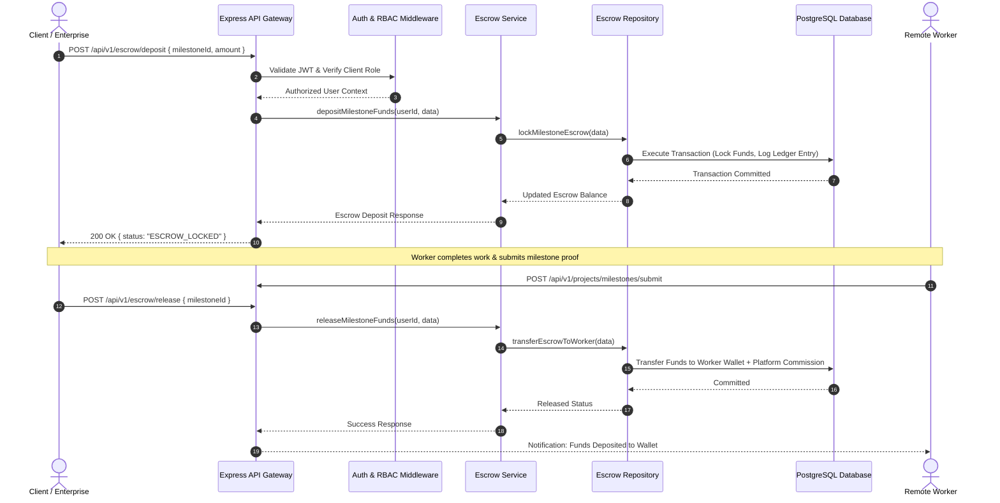

# 02. Solution Architecture & Technology Stack – TrustPay Enterprise v2.0

## 1. High-Level Architecture Overview

TrustPay Enterprise v2.0 is designed as a **Microservices-Ready Modular Monolith** structured within an npm workspace repository containing three distinct packages:
1. **`client`** (`trustpay-client`): Single Page Application built with React 18, Vite, Tailwind CSS, Framer Motion, and Three.js 3D Canvas.
2. **`server`** (`trustpay-server`): Express.js REST API server with Prisma ORM, JWT security middleware, and modular domain controllers.
3. **`shared`** (`trustpay-shared`): Shared validation schemas (Zod), business constants, and utilities common to frontend and backend.

```mermaid
graph TB
    subgraph Client Tier [Frontend - trustpay-client]
        UI[React 18 + Vite SPA]
        DS[Enterprise Design System]
        RTR[React Router v6]
        API_W[Client API Services Layer]
        UI --> DS
        UI --> RTR
        RTR --> API_W
    end

    subgraph API Tier [Backend - trustpay-server]
        GW[Express.js API Gateway / Middleware]
        SEC[Auth & RBAC Middleware]
        VAL[Zod Request Validator - trustpay-shared]
        CTRL[Domain Controllers]
        SVC[Business Logic Services Layer]
        REPO[Repository Data Access Layer]
        
        GW --> SEC
        SEC --> VAL
        VAL --> CTRL
        CTRL --> SVC
        SVC --> REPO
    end

    subgraph Data Tier [Database & Cloud Infrastructure]
        PGB[PgBouncer Connection Pooler]
        PG[(Supabase PostgreSQL Database)]
        REDIS[(Redis Cache Layer)]
        GCS[Cloud File Storage / Storage Engine]
        GEMINI[Google Gemini AI Engine API]
        
        REPO --> PGB
        PGB --> PG
        SVC --> REDIS
        SVC --> GCS
        SVC --> GEMINI
    end

    API_W -->|HTTPS REST JSON & Socket.io| GW
```

---

## 2. Request & Business Sequence Flow

### A. Escrow Payout Sequence Diagram
The diagram below illustrates the exact request lifecycle for creating, funding, and releasing an escrow milestone:

---

## 3. Technology Stack Rationale

Every technology in the TrustPay stack was selected based on strict enterprise requirements for performance, maintainability, type safety, scalability, and security.

### A. Frontend Architecture

| Technology | Purpose | Why Selected? | Alternatives Considered & Rejected |
| :--- | :--- | :--- | :--- |
| **React 18** | UI Component Engine | Declarative component model, virtual DOM efficiency, and vast ecosystem. | **Angular / Vue**: Heavier learning curve; weaker ecosystem for rich custom design systems. |
| **Vite 6** | Build Tool & Dev Server | Instant HMR (Hot Module Replacement), ES module bundling, and sub-17s production builds. | **Webpack / Create React App**: Extremely slow build times; legacy CRA is deprecated. |
| **Tailwind CSS** | Styling Engine | Utility-first CSS providing complete visual control without specificity bugs or runtime CSS-in-JS overhead. | **Styled-Components**: Runtime JavaScript performance overhead during dynamic renders. |
| **Three.js** | 3D Landing Experience | Hardware-accelerated WebGL 3D graphics rendering for a futuristic enterprise visual experience. | **Pure CSS 3D**: Insufficient performance and limited geometry capabilities. |
| **Framer Motion** | Micro-Animations | Physics-based fluid UI transitions and gesture controls for high-end UX. | **CSS Transitions**: Less control over complex sequence orchestrations. |

### B. Backend Architecture

| Technology | Purpose | Why Selected? | Alternatives Considered & Rejected |
| :--- | :--- | :--- | :--- |
| **Node.js 24** | Runtime Environment | High-throughput asynchronous event loop ideal for concurrent API requests and real-time Socket.io events. | **Python (Django)**: Blocking I/O overhead under heavy concurrent WebSocket connections. |
| **Express.js** | Web Framework | Lightweight, battle-tested, unopinionated routing framework with seamless middleware chaining. | **NestJS**: Excessive boilerplate for a modular monolith codebase. |
| **Prisma ORM** | Data Access Layer | Auto-generated type safety, migration engine, and schema relation management. | **TypeORM / Sequelize**: Prone to silent runtime mapping errors and weak schema synchronization. |
| **Zod** | Schema Validation | Declarative, composable validation schemas shared between frontend and backend. | **Joi / Yup**: Weak TypeScript integration and lack of shared frontend schema support. |

### C. Database & Infrastructure

| Technology | Purpose | Why Selected? | Alternatives Considered & Rejected |
| :--- | :--- | :--- | :--- |
| **PostgreSQL** | Primary Database | ACID compliance, JSONB support, strict relational integrity, and enterprise audit readiness. | **MongoDB**: Lack of multi-table transaction guarantees critical for escrow ledgers. |
| **PgBouncer** | Connection Pooler | Prevents PostgreSQL connection exhaustion during high-concurrency request spikes. | **Direct Connection**: Exhausts database connection limits under serverless/container scaling. |
| **Redis** | Caching & Rate Limit | In-memory key-value store for session caching, token revocation, and request rate limiting. | **Memcached**: Lacks data structure support and persistence capabilities. |
| **Google Gemini API**| Generative AI Engine | Enterprise-grade LLM for talent recommendation, contract risk evaluation, and executive summaries. | **OpenAI GPT-4**: Higher latency and higher API cost per token for structured JSON output. |

---

## 4. Layer Separation Architecture (Controller-Service-Repository Pattern)

TrustPay strictly adheres to clean 3-tier layer isolation:

1. **Controller Layer (`*.controller.js`)**:
   - Accepts HTTP requests, parses headers/cookies, invokes Zod validation, delegates to services, and returns standardized JSON responses using `ApiResponse`.
   - **Rule**: Zero database queries or business logic calculations permitted.

2. **Service Layer (`*.service.js`)**:
   - Contains all domain business rules, risk scoring, financial calculations, state machine transitions, and cross-module orchestrations.
   - **Rule**: Decoupled from HTTP request/response objects.

3. **Repository Layer (`*.repository.js`)**:
   - Handles database interactions using Prisma Client with built-in try-catch fallback handling for offline resilience.
   - **Rule**: Contains raw data queries and database transactions only.
