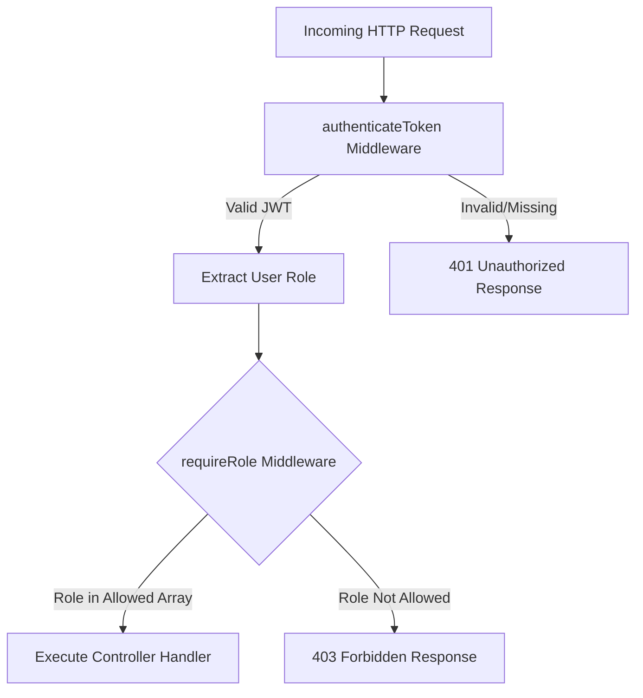

# 05. API Reference & Security Architecture – TrustPay Enterprise v2.0

## 1. API Design & Response Standardization

TrustPay APIs follow RESTful design patterns. All API endpoints return a unified JSON response envelope defined in `server/src/utils/ApiResponse.js`:

```json
{
  "success": true,
  "statusCode": 200,
  "message": "Operation completed successfully",
  "data": { ... },
  "timestamp": "2026-08-03T10:45:00.000Z"
}
```

In the event of an error, standard error envelopes are returned via `server/src/utils/ApiError.js`:

```json
{
  "success": false,
  "statusCode": 400,
  "message": "Validation Error: Field 'email' must be a valid email address",
  "errors": [ { "field": "email", "message": "Invalid email format" } ],
  "timestamp": "2026-08-03T10:45:00.000Z"
}
```

---

## 2. API Endpoint Specification (Selected Core Matrix)

| Domain | Method | Endpoint Route | Access Scope | Description |
| :--- | :--- | :--- | :--- | :--- |
| **Auth** | `POST` | `/api/v1/auth/register` | `Public` | Register user account |
| **Auth** | `POST` | `/api/v1/auth/login` | `Public` | Login & receive JWT |
| **Auth** | `POST` | `/api/v1/auth/refresh` | `Public` | Refresh access token |
| **Auth** | `POST` | `/api/v1/auth/logout` | `Authenticated` | Revoke session & clear cookies |
| **Marketplace**| `GET` | `/api/v1/marketplace/jobs` | `Public` | List & search active jobs |
| **Marketplace**| `POST` | `/api/v1/marketplace/jobs` | `CLIENT, ORG` | Create job post |
| **Marketplace**| `POST` | `/api/v1/marketplace/jobs/:id/apply`| `WORKER` | Submit proposal |
| **Contracts** | `POST` | `/api/v1/contracts` | `CLIENT` | Draft digital contract |
| **Contracts** | `POST` | `/api/v1/contracts/:id/sign` | `CLIENT, WORKER` | Digitally sign contract |
| **Contracts** | `GET` | `/api/v1/contracts/:id/pdf` | `Signatories` | Download PDF contract |
| **Escrow** | `GET` | `/api/v1/escrow/wallet` | `Authenticated` | Get wallet balance |
| **Escrow** | `POST` | `/api/v1/escrow/deposit` | `CLIENT` | Fund milestone escrow |
| **Escrow** | `POST` | `/api/v1/escrow/release` | `CLIENT, ADMIN` | Release milestone payout |
| **Workforce** | `POST` | `/api/v1/workforce/clock-in` | `WORKER` | Clock in with location |
| **Workforce** | `GET` | `/api/v1/workforce/timesheets` | `CLIENT, ADMIN` | View team timesheets |
| **Support** | `POST` | `/api/v1/support/tickets` | `Authenticated` | Create support ticket |
| **Support** | `POST` | `/api/v1/support/disputes` | `CLIENT, WORKER` | Raise milestone dispute |
| **Executive** | `GET` | `/api/v1/executive-analytics/overview` | `ADMIN, ORG` | Get BI dashboard |
| **Admin** | `GET` | `/api/v1/admin/users` | `ADMIN` | Manage platform users |
| **Performance**| `POST` | `/api/v1/performance/load-test` | `ADMIN` | Run load stress test |
| **Release** | `GET` | `/api/v1/release/overview` | `ADMIN` | View release status |
| **Release** | `POST` | `/api/v1/release/certify` | `ADMIN` | Lock v2.0 release |

---

## 3. Role-Based Access Control (RBAC) Scope Matrix

Permission enforcement is handled by `server/src/middlewares/auth.js` via the `requireRole([...roles])` middleware.



### RBAC Permission Matrix

| Feature Module | Guest User | Worker | Client | Org Admin | System Admin |
| :--- | :---: | :---: | :---: | :---: | :---: |
| **Browse Jobs & Talent** | ✅ | ✅ | ✅ | ✅ | ✅ |
| **Submit Proposal** | ❌ | ✅ | ❌ | ❌ | ❌ |
| **Create Job Post** | ❌ | ❌ | ✅ | ✅ | ✅ |
| **Sign Contract** | ❌ | ✅ | ✅ | ✅ | ❌ |
| **Fund Escrow** | ❌ | ❌ | ✅ | ✅ | ❌ |
| **Clock In / Out** | ❌ | ✅ | ❌ | ❌ | ❌ |
| **Approve Timesheets** | ❌ | ❌ | ✅ | ✅ | ✅ |
| **Arbitrate Dispute** | ❌ | ❌ | ❌ | ❌ | ✅ |
| **View Executive BI** | ❌ | ❌ | ❌ | ✅ | ✅ |
| **System Admin Controls** | ❌ | ❌ | ❌ | ❌ | ✅ |

---

## 4. Security Hardening & OWASP Top 10 Safeguards

1. **Injection Protection (SQLi & NoSQLi)**:
   - All database queries are executed using Prisma ORM parameterized statements. Raw SQL strings are prohibited.
2. **Broken Authentication Safeguards**:
   - Passwords hashed with `bcryptjs` (salt 10).
   - Refresh tokens stored in HTTP-only, `SameSite=Strict` secure cookies preventing XSS token theft.
3. **Sensitive Data Exposure Prevention**:
   - Password hashes, JWT secrets, and private keys are excluded from `User` model JSON serialization defaults.
4. **Broken Access Control Fixes**:
   - Ownership checks verify that `req.user.id` matches the contract or wallet owner before performing updates.
5. **Rate Limiting & DDoS Prevention**:
   - `express-rate-limit` enforces a maximum of 100 requests per 15-minute window per IP address on public endpoints.
6. **Security Headers (Helmet)**:
   - `helmet()` automatically injects `X-Content-Type-Options: nosniff`, `X-Frame-Options: DENY`, and Strict CSP headers.
